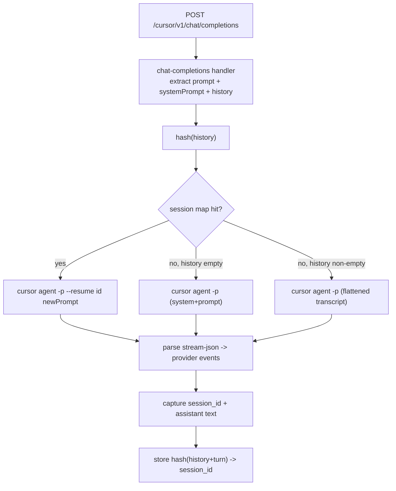

# Add Cursor CLI (`cursor agent -p`) support

Mirror the existing `ClaudeProvider` with a new `CursorProvider`, reusing the same `AgentProvider` interface, event model, and `FileSystemKvStore` session-mapping pattern. No new dependencies.

## What I verified by running the CLI

- `cursor-agent` (`/opt/homebrew/bin/cursor-agent`) and `cursor agent` are the same binary: identical version (`2026.06.02-8c11d9f`), identical `stream-json` schema, and identical `create-chat`/`--resume` semantics (verified context recall across turns). The only difference is invocation: `cursor-agent <args>` vs `cursor agent <args>`. The provider prefers `cursor-agent`, then falls back to `cursor agent`. Needs `--trust` for the managed workspace.
- `--output-format stream-json --stream-partial-output` emits NDJSON lines: `system/init` (`session_id`, `model`), `thinking` (`subtype: delta|completed`), `tool_call` (`subtype: started|completed`; tool name is the object key e.g. `readToolCall`/`shellToolCall`, with `args` and `result`), `assistant` text blocks, final `result` (`result` text + `usage`).
- Token deltas are followed by a consolidated block copy; dedup by comparing against the accumulated block text.
- `--resume <id>` preserves context natively; chat history is stored in an opaque SQLite blob DB (`~/.cursor/chats/<workspaceHash>/<id>/store.db`, content-addressed blobs), so it is NOT seedable like Claude's JSONL. There is no `--system-prompt` flag. Without `--force` (org-disabled here), write/shell tools auto-reject without hanging; read tools auto-run.
- Tested and rejected: seeding history by hand-writing `~/.cursor/projects/<encodedPath>/agent-transcripts/<id>/<id>.jsonl`. That file is an output LOG, not the resume source. With tools forbidden, a resumed agent reported it "only includes your latest message" and had no seeded turns in context. (A first test seemed to recall a seeded word, but only because the agent grepped the transcript file off disk - a confound, not context injection.) Conclusion: history cannot be reconstructed via files; the cold-start path must flatten history into the prompt.

## Request flow



## New file: `src/providers/cursor.ts`

Follows `[src/providers/claude.ts](src/providers/claude.ts)`. Exports:

- `CursorProvider implements AgentProvider` (`name = 'cursor'`) -> `streamCursorChatCompletion`.
- `resolveCursorCommand()`: returns `{ command, baseArgs }`. Resolution order: (1) `cursor-agent` on PATH (`baseArgs: []`), (2) `cursor` on PATH (`baseArgs: ['agent']`), (3) fallback paths `/opt/homebrew/bin/cursor-agent`, `~/.local/bin/cursor-agent`, then `~/.local/bin/cursor` (with `agent`). Cached like `resolveClaudeCommand`. The subprocess runs `[command, ...baseArgs, ...buildCursorArgs(...)]` so both invocation styles share one arg builder.
- `buildCursorArgs(input, resumeSessionId?, prompt)`: flag portion after the subcommand:

```bash
-p --output-format stream-json --stream-partial-output --trust \
  [--force]            # only if CURSOR_FORCE is set
  [--model <model>]    # only if request model provided
  [--resume <id>]      # only on session-map hit
  <prompt>
```

- `streamCursorChatCompletion(input, signal)`: `execa([...baseArgs, ...buildCursorArgs(...)])` with `cwd = ensureAgentWorkspaceDir()`, parse NDJSON via `readline` and yield events:
  - `system/init` -> `response.metadata` (model); capture `session_id`.
  - `thinking` `subtype: delta` -> `response.output_reasoning.delta` (`format: 'cursor-agent-v1'`).
  - `tool_call/started` -> `response.output_tool_call.delta` (`toolCallId = call_id`, `toolName` from the key minus `ToolCall`, `toolArguments = JSON.stringify(args)`).
  - `tool_call/completed` -> `response.output_tool_result.delta` (`toolOutput = JSON.stringify(result)`).
  - `assistant` text -> dedup: keep per-block accumulator; if text equals the accumulator, treat as consolidation and skip (reset on tool_call boundary); otherwise emit `response.output_text.delta` and append.
  - `result` -> `is_error`/`subtype === 'error'` throws; else capture fallback text, `usage`, `finishReason`, `session_id`.
- `normalizeCursorUsage`: map `inputTokens|outputTokens` to `prompt_tokens|completion_tokens|total_tokens`, `cacheReadTokens` to `prompt_tokens_details.cached_tokens`; keep `duration_ms`, `duration_api_ms`, `request_id`, `cacheWriteTokens` as extras (parity with `normalizeClaudeUsage`).

### Multi-turn continuity (self-tracked mapping)

- `CURSOR_SESSION_MAPPING_STORE_ID = 'cursor/session_mapping/v1'`, version `'v1'`; reuse `[src/file-system-kv-store.ts](src/file-system-kv-store.ts)`.
- `prepareCursorResumeSession(input)`: `historyHash = sha256(normalize(history))`; `claim` the mapping. Hit -> `{ sessionId, historyHash }` (resume, skip system-prompt prepend). Miss + empty history -> fresh run (prepend system prompt). Miss + non-empty history -> `flattenCursorHistory(history)` transcript prepended to the new prompt (cold-start replay), fresh run. File-based history seeding was tested and does not inject context (see verification notes), so flattening is the only viable cold-start replay.
- Mapping is moved forward, not duplicated (mirrors Claude): `claim()` is destructive (rename + delete), so a HIT removes the prior-turn key `hash([..u2,a2])` immediately, and the post-run `set` writes the new key `hash([..u2,a2,u3,a3])`. At any time only the latest full-history hash points to `S`; intermediate prefixes are gone. Consequences: re-sending an earlier prefix cold-starts; a crash/concurrent retry between `claim` and `set` orphans `S` and cold-starts next time (intended concurrency guard).
- After completion (for ALL paths - resume, fresh, AND flatten): `newHistoryHash = sha256(normalize(history + [{user, prompt}, {assistant, assistantText}]))`; `set(newHistoryHash -> session_id)` so the next incremental request is a native `--resume` hit. Failures are swallowed (parity with `tryUpdateClaudeSessionMapping`).
- Continuity after a flatten cold-start: the flattened run still captures its `session_id` and registers it under the full-conversation hash, so it becomes a normal resumable session. The next continuing call hashes its history (which now equals that full conversation) -> HIT -> native `--resume` (no re-flatten). It only re-flattens/creates a new session on a true cache miss: lost KV mapping, a concurrent retry racing the destructive `claim()`, or the client resending assistant text that does not byte-match what we recorded. To maximize match rate, `normalizeCursorResumeHistory` must strip reasoning/`[REDACTED]`-style content (we hash the text we emit because Cursor's store is unreadable, unlike Claude where the session file is re-read for canonical text).

## Wiring + docs

- `[src/server.ts](src/server.ts)` (~lines 39-44): add `new CursorProvider()` to the default providers list next to `ClaudeProvider`.
- `[src/index.ts](src/index.ts)`: export the new public Cursor symbols (provider, `buildCursorArgs`, `parseCursorLine`, `normalizeCursorUsage`, store id/version, hash/flatten helpers).
- `[README.md](README.md)`: add a Cursor section, route `/cursor/v1/chat/completions`, equivalent CLI flags, model slugs (`cursor agent --list-models`), system-prompt-via-prepend note, and the permission/`--force` caveat.

## Tests

- `tests/cursor.test.ts` (mirrors `[tests/claude.test.ts](tests/claude.test.ts)`): `buildCursorArgs` variants, `parseCursorLine`, `normalizeCursorUsage`, tool-name extraction, assistant delta/consolidation dedup, history hash + flatten, and session-mapping claim/update via a temp `DATA_DIR`.
- Optional `tests/cursor.integration.test.ts` mirroring `tests/claude.integration.test.ts`, skipped when the `cursor` binary is absent.
- Run `pnpm typecheck`, `pnpm lint`, `pnpm test`.